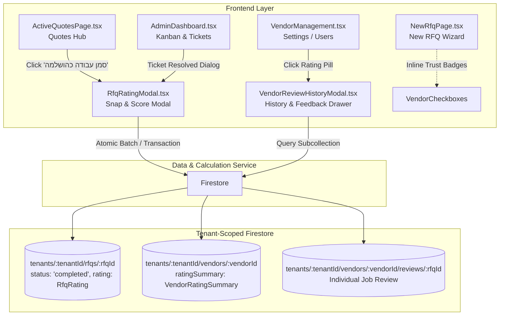

# TDD & Implementation Plan: TikTak Contractor Rating, Feedback & RFQ Completion Lifecycle
## תכנון טכני: סגירת מכרז, דירוג "Snap & Score", ומוניטין ספקים

**Document Status**: Engineering Design (v1.0)  
**Target Milestone**: Contractor Reputation & RFQ Completion  
**Associated PRD**: [contractor_rating_and_feedback_prd.md](file:///c:/Users/orenb/OneDrive/Desktop/TikTak/docs/PRDS/contractor_rating_and_feedback_prd.md)  
**Stakeholder & QA Gatekeeper**: Oren Bodner (Lead Architect & Senior QA Lead)  
**Date**: October 2026  

---

## 1. Architectural Overview & Component Topology



---

## 2. Data Models & TypeScript Interfaces

### 2.1 Updates to `frontend/src/types/rfq.ts`

```typescript
// 1. Extended RFQ Status
export type RfqStatus = 'draft' | 'open' | 'awarded' | 'completed' | 'expired' | 'cancelled';

// 2. Rating Payload on RFQ
export interface RfqRating {
  stars: number;         // 1 to 5
  wouldRehire: boolean;  // true = כן, בהחלט | false = לא
  tags: string[];        // e.g. ['עמידה בזמנים', 'מקצועיות גבוהה']
  comment?: string;      // Optional admin internal note
  ratedAt: string;       // ISO string
  ratedBy: {
    uid: string;
    name: string;
  };
}

// 3. WorkQuoteRequest additions
export interface WorkQuoteRequest {
  // Existing fields...
  id: string;
  tenantId: string;
  status: RfqStatus;
  awardedVendorId?: string;
  awardedQuoteId?: string;
  awardedVendorName?: string;
  awardedPrice?: number;
  
  // New Lifecycle & Rating fields:
  completedAt?: string;
  completedBy?: {
    uid: string;
    name: string;
  };
  rating?: RfqRating;
}

// 4. Vendor Aggregated Reputation
export interface VendorRatingSummary {
  averageScore: number;     // 1.0 - 5.0 (rounded to 1 decimal place)
  totalReviews: number;     // Total completed RFQs rated
  rehireCount: number;      // Total positive rehire verdicts
  rehirePercentage: number; // 0 - 100%
  topTags: string[];        // Top frequent tags
  lastRatedAt: string;      // ISO String
}

// 5. Vendor Entity updates
export interface Vendor {
  id: string;
  fullName: string;
  phone: string;
  email?: string;
  companyId?: string;
  categories: string[];
  vendorType: VendorType;
  notes?: string;
  createdAt?: string;
  updatedAt?: string;
  ratingSummary?: VendorRatingSummary; // Aggregated score
}

// 6. Review Document Schema (Subcollection)
export interface VendorReviewRecord {
  id: string;          // rfqId
  rfqId: string;
  rfqTitle: string;
  rfqCategory: string;
  awardedPrice?: number;
  stars: number;
  wouldRehire: boolean;
  tags: string[];
  comment?: string;
  ratedAt: string;
  ratedBy: {
    uid: string;
    name: string;
  };
}
```

---

## 3. Core Component Design & Responsibilities

### 3.1 `RfqRatingModal.tsx` ("Snap & Score" Micro-Survey)
- **Props**:
  - `isOpen: boolean`
  - `onClose: () => void`
  - `rfq: WorkQuoteRequest`
  - `vendorId: string`
  - `vendorName: string`
  - `currentAdmin: { uid: string; name: string }`
  - `onSuccess: (updatedRating: RfqRating) => void`
- **Features**:
  - Pre-populates if `rfq.rating` already exists (edit mode).
  - 1–5 Stars interactive row with smooth hover/touch transitions and dynamic Hebrew sentiment labels.
  - Would Rehire toggle pills: `👍 כן, בהחלט` (defaults to checked if stars >= 4) / `👎 לא`.
  - Chip pills for quick tags:
    - Positive: `עמידה בזמנים`, `מקצועיות גבוהה`, `מחיר הוגן`, `נקי ומסודר`, `תקשורת מצוינת`.
    - Warning/Constructive: `איחור בביצוע`, `ניסיון לייקר מחיר`, `השאיר לכלוך`, `לא זמין בטלפון`.
  - Optional note textarea with max 200 characters.
  - Submits via atomic batch write to:
    1. `tenants/${tenantId}/rfqs/${rfq.id}` -> `{ rating, updatedAt }`
    2. `tenants/${tenantId}/vendors/${vendorId}/reviews/${rfq.id}` -> Review document
    3. `tenants/${tenantId}/vendors/${vendorId}` -> Updated `ratingSummary`

### 3.2 `VendorReviewHistoryModal.tsx` (Review History Drill-Down)
- **Props**:
  - `isOpen: boolean`
  - `onClose: () => void`
  - `tenantId: string`
  - `vendor: Vendor`
- **Features**:
  - Real-time/one-time query on `tenants/${tenantId}/vendors/${vendor.id}/reviews` ordered by `ratedAt desc`.
  - Header with summary KPI banner: Average Stars, Total Jobs, Rehire %, Top Tags.
  - Chronological card list showing job title, category, date, price, stars, tags, and internal committee comment.

### 3.3 `ActiveQuotesPage.tsx` Updates
- **"סמן עבודה כהושלמה" Action**:
  - On `awarded` cards: Provide high-contrast button `סמן עבודה כהושלמה ✓`.
  - When clicked:
    - Sets `status = 'completed'`, `completedAt = nowIso`, `completedBy = currentAdmin`.
    - Updates Firestore.
    - Audit log: `RFQ_COMPLETED`.
    - Automatically opens `RfqRatingModal`.
- **Completed Card State**:
  - Status badge: `העבודה הושלמה בהצלחה ✓`.
  - If rated: displays star pill `⭐ {stars}/5` + `(ערוך)`.
  - If not yet rated: displays `⭐ דרג קבלן` button.
- **Filter Tabs**:
  - Filter tab labeled `הצעות שנסגרו / נבחרו` properly handles both `awarded` and `completed` RFQs.

### 3.4 `VendorManagement.tsx` Updates
- On each vendor card:
  - Add reputation badge:
    - If `vendor.ratingSummary`: `⭐ {averageScore} ({totalReviews} עבודות) • {rehirePercentage}% יזמינו שוב`.
    - If empty: `טרם נצבר דירוג`.
  - Clicking on the rating badge opens `VendorReviewHistoryModal`.

### 3.5 `NewRfqPage.tsx` Updates
- When fetching vendors, map `ratingSummary`.
- Beside each vendor checkbox in the target contractor selection list, display inline reputation badge:
  - `⭐ {ratingSummary.averageScore} ({ratingSummary.totalReviews}) • {rehirePercentage}% Rehire`.
  - If rating < 3.0, display subtle warning icon `⚠️`.

---

## 4. Atomic Calculation Logic & Multi-Tenancy

When a review is submitted:
```typescript
export async function saveVendorReview({
  tenantId,
  rfqId,
  rfqTitle,
  rfqCategory,
  awardedPrice,
  vendorId,
  rating,
  admin
}: {
  tenantId: string;
  rfqId: string;
  rfqTitle: string;
  rfqCategory: string;
  awardedPrice?: number;
  vendorId: string;
  rating: { stars: number; wouldRehire: boolean; tags: string[]; comment?: string };
  admin: { uid: string; name: string };
}) {
  const nowIso = new Date().toISOString();
  const rfqRef = doc(db, 'tenants', tenantId, 'rfqs', rfqId);
  const vendorRef = doc(db, 'tenants', tenantId, 'vendors', vendorId);
  const reviewRef = doc(db, 'tenants', tenantId, 'vendors', vendorId, 'reviews', rfqId);

  // 1. Fetch all existing reviews for this vendor to calculate exact aggregates
  const reviewsSnap = await getDocs(collection(db, 'tenants', tenantId, 'vendors', vendorId, 'reviews'));
  const otherReviews = reviewsSnap.docs
    .filter(d => d.id !== rfqId)
    .map(d => d.data() as VendorReviewRecord);

  const allReviews = [
    ...otherReviews,
    {
      id: rfqId,
      rfqId,
      rfqTitle,
      rfqCategory,
      awardedPrice,
      stars: rating.stars,
      wouldRehire: rating.wouldRehire,
      tags: rating.tags,
      comment: rating.comment,
      ratedAt: nowIso,
      ratedBy: admin
    }
  ];

  const totalReviews = allReviews.length;
  const sumScores = allReviews.reduce((sum, r) => sum + r.stars, 0);
  const averageScore = Math.round((sumScores / totalReviews) * 10) / 10;
  const rehireCount = allReviews.filter(r => r.wouldRehire).length;
  const rehirePercentage = Math.round((rehireCount / totalReviews) * 100);

  // Tag frequency
  const tagCounts: Record<string, number> = {};
  allReviews.forEach(r => {
    r.tags?.forEach(t => {
      tagCounts[t] = (tagCounts[t] || 0) + 1;
    });
  });
  const topTags = Object.entries(tagCounts)
    .sort((a, b) => b[1] - a[1])
    .slice(0, 3)
    .map(entry => entry[0]);

  const ratingSummary: VendorRatingSummary = {
    averageScore,
    totalReviews,
    rehireCount,
    rehirePercentage,
    topTags,
    lastRatedAt: nowIso
  };

  const batch = writeBatch(db);
  batch.update(rfqRef, {
    rating: {
      stars: rating.stars,
      wouldRehire: rating.wouldRehire,
      tags: rating.tags,
      comment: rating.comment || null,
      ratedAt: nowIso,
      ratedBy: admin
    },
    updatedAt: nowIso
  });

  batch.set(reviewRef, {
    rfqId,
    rfqTitle,
    rfqCategory,
    awardedPrice: awardedPrice || null,
    stars: rating.stars,
    wouldRehire: rating.wouldRehire,
    tags: rating.tags,
    comment: rating.comment || null,
    ratedAt: nowIso,
    ratedBy: admin
  });

  batch.update(vendorRef, {
    ratingSummary,
    updatedAt: nowIso
  });

  await batch.commit();
}
```

---

## 5. Phased Implementation Roadmap

- **Phase 1: Foundation & Types**:
  - Update `types/rfq.ts` with `completed` status, `RfqRating`, and `VendorRatingSummary`.
  - Create the `saveVendorReview` atomic helper utility.
- **Phase 2: "Snap & Score" Modal Component**:
  - Implement `RfqRatingModal.tsx` with stars, rehire toggle, quick chips, and skip flow.
- **Phase 3: Quotes Hub Integration (`ActiveQuotesPage.tsx`)**:
  - Add "סמן עבודה כהושלמה" button on awarded cards.
  - Wire status change to `'completed'` and trigger `RfqRatingModal`.
  - Handle completed badge and "ערוך דירוג" button.
- **Phase 4: Vendor Management & Reputation History**:
  - Add rating badges to `VendorManagement.tsx`.
  - Build `VendorReviewHistoryModal.tsx` for timeline drilldown.
- **Phase 5: New RFQ Wizard Selection Badges**:
  - Render vendor reputation summary inline next to checkboxes in `NewRfqPage.tsx`.
- **Phase 6: Quality Assurance & Vitest Verification**:
  - Verify calculation logic, status transitions, edge cases (no reviews, edit review, tenant isolation).

---

## 6. Senior QA Verification Checklist

1. [ ] Clicking "סמן עבודה כהושלמה" on an `awarded` RFQ updates Firestore `status: 'completed'` and sets `completedAt`.
2. [ ] Clicking "סמן עבודה כהושלמה" opens `RfqRatingModal` immediately.
3. [ ] Submitting a 5-star review updates both the RFQ document and the vendor's `ratingSummary` and `reviews` subcollection.
4. [ ] In `ActiveQuotesPage`, a completed RFQ displays the rating badge with an option to edit.
5. [ ] In `Settings -> Users/Vendors`, the vendor displays `⭐ {score} ({count} עבודות) • {rehire}% יזמינו שוב`.
6. [ ] Clicking the vendor rating badge opens the review history modal with past RFQ titles, dates, and notes.
7. [ ] In `NewRfqPage`, selecting contractors shows live reputation next to each contractor checkbox.
8. [ ] Clicking "דלג כעת" in `RfqRatingModal` marks the RFQ completed without throwing errors, leaving a "דרג קבלן" button.
