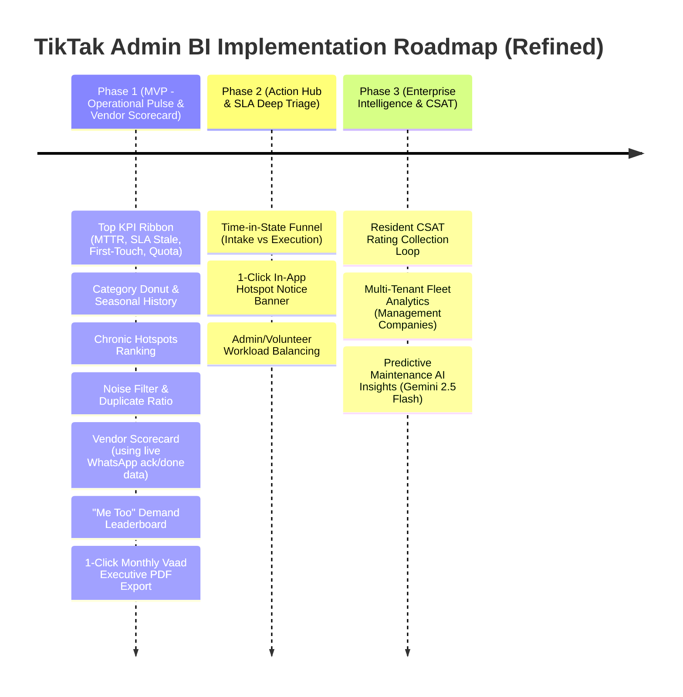

# PRD: TikTak Admin BI & Operational Analytics Hub (מרכז סטטיסטיקה ומודיעין עסקי)

**Document Status**: Approved Architecture Specification (v1.1)  
**Version**: 1.1.0  
**Author**: TikTak Lead Product Manager (TikTak-PM) & Lead Architect  
**Stakeholder & Quality Gatekeeper**: Oren Bodner (Lead Architect & Senior QA Lead)  
**Target Release**: TikTak Admin Modernization (BI & Analytics Module)  
**Date**: September 2026  

---

## 1. Executive Summary & Problem Statement

### 1.1 Context
TikTak provides a zero-friction "Snap & Send" reporting interface for residents and a streamlined Kanban board for building committees (Vaad) and property managers. However, as ticket volume grows, committees face critical operational blind spots:
1. **Vanity Metrics vs. Actionable Intelligence**: Basic counts of "open vs. closed" tickets fail to reveal recurring infrastructural failures (e.g., chronic sprinkler leaks or persistent corridor light failures).
2. **Volunteer & Admin Burnout**: Unmonitored ticket stagnation, uneven volunteer workload distribution, and lack of first-touch SLAs lead to committee fatigue and resident dissatisfaction.
3. **Contractor & Vendor Opacity**: Property managers need quantitative leverage when evaluating maintenance contracts. Currently, TikTak's backend tracks vendor acceptance and completion timestamps via WhatsApp interactive quick-replies, but these metrics are not aggregated into an executive scorecard.
4. **Noise & Out-of-Scope Overhead**: Up to 25% of incoming resident reports pertain to municipal scope (e.g., public city park equipment) or represent duplicate reports, draining volunteer hours without being distinguished in standard reporting.

### 1.2 Proposed Solution: The 4-Layer Operational BI Hub
A dedicated **Admin BI & Analytics Page** (`/admin/:tenantId/analytics`), accessible from the admin sidebar, structured across four operational intelligence layers:
1. **Executive Health & Operational Pulse (Top KPI Ribbon)**: Instant visibility into real-time operational tempo (MTTR, SLA Stagnation, First-Touch Response, Monthly Quota).
2. **Operational Efficiency & Root-Cause Analytics**: Density heatmaps for chronic hotspots, category & seasonality trends, and the "Noise Filter" duplicate ratio.
3. **SLA & Transparency Tracking**: Time-in-state triage funnels, "Me Too" (📢) resident demand multiplier, and CSAT satisfaction trendlines.
4. **Vendor & Contractor Performance Scorecard**: Live aggregation of WhatsApp-tracked vendor response times, execution speeds, and category reliability per contractor.
5. **Actionable Triggers**: One-click in-app resident notice banner pinning for incident hotspots, monthly executive board PDF/print exports, and smart volunteer workload distribution.

---

## 2. Strategic Alignment & Core Principles

| Principle | Implementation in Admin BI Hub |
| :--- | :--- |
| **The 5-to-2 Rule** | The BI page is an **action launcher**, not a passive graveyard of graphs. Clicking an alert, hotspot, or SLA zone triggers a 1-click resolution action (e.g., pin resident notice banner, vendor follow-up, or filtered drilldown). |
| **Scale-to-Zero & Cost Minimalism** | Client-side aggregation on the active tenant ticket collection. No expensive data warehouse or heavy continuously running background compute. Zero extra cloud cost for small-to-medium communities. |
| **Strict Multi-Tenancy (Data Isolation)** | Every metric calculation, query, and chart data point is strictly scoped to `tenants/{tenantId}/tickets`. Zero cross-tenant data leakage. |
| **RTL-Native Hebrew First** | Recharts and custom analytical cards designed natively for Hebrew (Right-to-Left), formatted dates with `date-fns/locale/he`, and clear terminology tailored to Israeli committees. |
| **Executive Board Ready** | Single-click export of a clean, branded, high-contrast PDF/print summary suitable for presentation at annual general meetings (AGMs) and committee reviews. |

---

## 3. Product Architecture: The 4 Operational Layers

```
┌────────────────────────────────────────────────────────────────────────────────────────┐
│ Layer 1: Top KPI Ribbon                                                                │
│ [ MTTR: 1.8 days ]  [ SLA Stagnation: 3 Red / 5 Orange ]  [ First-Touch: 42 min ]  [ Quota: 18/35 (51%) ] │
└────────────────────────────────────────────────────────────────────────────────────────┘
┌───────────────────────────────────────────────┬────────────────────────────────────────┐
│ Layer 2: Root-Cause & Spatial Analytics       │ Layer 3: SLA & Community Demand        │
│ • Geographic / Resource Hotspots (Top 5)     │ • Time-in-State Funnel (Intake vs Work)│
│ • Category Distribution & Seasonal Rhythm     │ • "Me Too" (📢) Demand Multiplier      │
│ • Noise Filter (Duplicates / Outside Scope)   │ • Resident CSAT Satisfaction Trendline │
└───────────────────────────────────────────────┴────────────────────────────────────────┘
┌────────────────────────────────────────────────────────────────────────────────────────┐
│ Layer 4: Vendor & Contractor Performance Scorecard (Active Telemetry from WhatsApp)    │
│ [ Vendor Name | Specialty | Dispatches | Avg Ack (Min) | Avg Fix (Hrs) | SLA Adherence ]│
└────────────────────────────────────────────────────────────────────────────────────────┘
┌────────────────────────────────────────────────────────────────────────────────────────┐
│ Actionable Capabilities Bar:                                                           │
│ [ 📌 1-Click In-App Hotspot Notice ]  [ 📄 Export Monthly Vaad PDF ]  [ ⚖️ Workload Balance ] │
└────────────────────────────────────────────────────────────────────────────────────────┘
```

---

## 4. Detailed Functional Specifications

### 4.1 Layer 1: Executive Health & Operational Pulse (Top KPI Ribbon)

1. **MTTR (Mean Time to Resolution)**:
   - **Formula**: $\text{MTTR} = \frac{\sum (\text{resolvedAt} - \text{createdAt})}{\text{Total Resolved Tickets}}$ (measured in business hours/working days via `slaEngine`).
   - **Visual**: Primary metric card with comparison delta against previous 30-day window (e.g., `1.8 ימים` with `↓ 15% שיפור לעומת חודש קודם`).
   - **Exclusions**: Tickets closed with reasons `duplicate`, `irrelevant`, or `outside` are excluded from MTTR calculations to prevent skew.

2. **Active Stagnation Alert (SLA Stale Count)**:
   - **Visual**: Traffic-light counter showing open tickets lingering in:
     - 🟡 **צהוב (Yellow)**: 2–4 working days without resolution (`stale-2`).
     - 🟠 **כתום (Orange)**: 5–8 working days without resolution (`stale-5`).
     - 🔴 **אדום (Red)**: 9+ working days without resolution (`stale-9`).
   - **Interaction**: Clicking any color zone acts as an instant filter deep-link to the Kanban board (`/admin/:tenantId/dashboard?sla=stale-9`).

3. **First-Touch Response Rate (זמן תגובה ראשוני)**:
   - **Data Hygiene & Calculation Strategy**:
     - *Legacy / Existing Tickets*: Derived gracefully as the earliest timestamp among:
       1. First admin comment (`adminComments[0].createdAt`).
       2. First vendor dispatch (`lastVendorForwardAt` or `vendors[0].sentAt`).
       3. First transition to `in-progress` or `backlog`.
     - *New Tickets*: Explicitly stored on the ticket document as `firstTouchAt` (ISO string) upon the first qualifying admin interaction.
   - **Target Benchmark**: `< 2 שעות` (High), `2–24 שעות` (Moderate), `> 24 שעות` (Attention required).

4. **Monthly Quota Gauge (מד ניצול מכסת תוכנית)**:
   - **Visual**: High-contrast visual progress bar showing net billable consumed tickets vs. tenant base quota (e.g., `18 / 35 פניות מנוצלות — 51%`).
   - **Exclusion Logic**: Adheres to TikTak's established `quotaEngine`: tickets closed as `duplicate`, `outside`, or `irrelevant` are marked non-billable and subtracted from consumed quota.
   - **Status Indicators**: Safe (<70%), Warning (70–89%), Critical / Upgrade Needed (90%+).

---

### 4.2 Layer 2: Operational Efficiency & Root-Cause Analytics

1. **Geographic & Resource Heatmap / Hotspots (מוקדי כשל חוזרים)**:
   - **Purpose**: Identifies chronic infrastructure failures in physical assets before residents submit repeat complaints.
   - **Data Aggregation**: Groups tickets by `location` (e.g., "מעלית B", "חניון -1", "לובי ראשי", "גנ\"ש הרחבה ב").
   - **Display**: Ranked horizontal density list with incident count, primary category icon, and recurring issue warning (e.g., `⚠️ 4 דיווחים החודש - נזילת מים חוזרת`).
   - **Action**: 1-click button to pin an In-App Resident Notice Banner for that location.

2. **Category Breakdown & Seasonality Trends (התפלגות קטגוריות ומגמות תקופתיות)**:
   - **Interactive Donut Chart**: Proportional volume across categories (תאורה, ניקיון/פסולת, אינסטלציה, מעליות, גינון, בינוי).
   - **Temporal Trendline (Monthly/Weekly Bar Chart)**: Stacked bars showing category shifts across the last 6 months or 12 weeks.
   - **Operational Value**: Highlights seasonal surges (e.g., increased landscape/drainage issues in winter, waste spikes around holiday weekends) to adjust preventative vendor contracts.

3. **The "Noise Filter" & Duplicate Ratio (מדד רעש ופניות סרק)**:
   - **Formula**: $\text{Noise Ratio} = \frac{\text{Tickets Closed as Duplicate + Outside Scope + Irrelevant}}{\text{Total Closed Tickets}} \times 100$.
   - **Visual**: Split gauge displaying:
     - 🗂️ כפילויות (Duplicate reports).
     - 🏛️ מחוץ לאחריות / מועצה (Outside scope - municipal/council).
     - 🚫 לא רלוונטי / סרק (Irrelevant).
   - **Automated Advisory**: If Municipal Scope $> 15\%$, prompts the admin: *"המלצה: הצב באנר הודעה בדף הדיווח של הדיירים להפניית מפגעי עירייה למוקד 106"*.

---

### 4.3 Layer 3: Service Level Agreements (SLA) & Transparency Tracking

1. **Time-in-State Funnel (משפך זמני טיפול לפי שלב)**:
   - **Visualization**: Horizontal progress funnel showing aggregate average days spent per stage:
     - `קליטה ומיון (New $\to$ In-Progress)`: Administrative triage time.
     - `ביצוע וטיפול (In-Progress $\to$ Resolved)`: Active contractor/superintendent execution time.
   - **Value**: Discloses whether bottlenecks originate in committee decision-making or vendor field execution.

2. **"Me Too" (📢) Demand Multiplier (מדד דרישת קהילה)**:
   - **Data Source**: Live aggregation of `meToo` upvotes recorded from resident interactions on `/report/:tenantId/dashboard`.
   - **Display**: Leaderboard of active tickets sorted by upvote count, displaying ticket title, location, upvote badge, and status.
   - **Decision Support**: Enables committees to prioritize issues that affect 15+ families (e.g., main gate motor or boiler pump) over cosmetic single-apartment requests.

3. **Resident Satisfaction (CSAT) Trendline (שביעות רצון דיירים)**:
   - **Data Source**: Post-resolution feedback (1 to 5 stars + optional short text) gathered when residents view ticket resolution.
   - **Visual**: Rolling CSAT average rating with sentiment distribution (Positive / Neutral / Negative) correlated against resolution speed.

---

### 4.4 Layer 4: Vendor & Contractor Performance Scorecard (Active Telemetry)

TikTak's backend (`whatsappWebhook` in `functions/src/index.ts`) already captures vendor interactions via interactive WhatsApp quick-replies:
- **Acceptance Event**: Button `"קיבלתי את ההודעה"` (`VENDOR_ACK`) $\to$ Records `acknowledgedAt`, `ackTimeSeconds`, `ackTimeMinutes`.
- **Done Event**: Button `"בוצע"` (`VENDOR_DONE`) $\to$ Records `completedAt`, `executionTimeSeconds`, `executionTimeMinutes`, `totalResolutionTimeMinutes`.

| Metric | Telemetry Source in `ticket.vendors[]` | Management Impact |
| :--- | :--- | :--- |
| **Vendor Acceptance Time (זמן מענה לספק)** | `vItem.ackTimeMinutes` (from `sentAt` to `acknowledgedAt`) | Identifies unresponsive or overloaded service providers. |
| **Field Execution Duration (משך ביצוע בשטח)** | `vItem.executionTimeMinutes` (from `acknowledgedAt` to `completedAt`) | Compares actual field turnaround vs contracted vendor SLAs. |
| **Category Reliability Rate (מדד אמינות)** | Percentage of dispatches resolved with `status === 'בוצע'` without re-dispatch. | Delivers quantitative leverage for annual service contract renewals or vendor replacement. |

- **UI Format**: Compact vendor evaluation table with filter by specialty (חשמלאי, אינסטלטור, טכנאי מעליות, גנן). Includes direct WhatsApp follow-up button.

---

### 4.5 Actionable Capabilities (The "Action Hub")

1. **One-Click In-App Resident Notice Banner from Hotspots (באנר הודעות דיירים ממוקד תקלה)**:
   - **Mechanism**: In place of spam-prone mass WhatsApp messaging, clicking `📌 הצב הודעה לדיירים` on a hotspot card (e.g., "מעלית B - 5 פניות") opens a modal to immediately publish an **In-App Pinned Notice Banner** on the resident reporting page (`/report/:tenantId`).
   - **Preset Copy**:
     `"שימו לב: תקלה במעלית B ידועה ונמצאת בטיפול טכנאי (צפי סיום: היום ב-16:00). אין צורך לדווח שוב."`
   - **Resident Experience**: Displayed prominently at the very top of `/report/:tenantId` with an alert badge, preventing up to 90% of duplicate reports before the camera is triggered.
   - **Optional Copy to Clipboard**: Includes a 1-click button to copy the formatted text for pasting into the building's WhatsApp community group if desired.

2. **Monthly Vaad/Council Executive PDF Export (דוח חודשי מנהלים / ישיבת ועד)**:
   - **Trigger**: Header action button `📄 הפק דוח לוועד (PDF)`.
   - **Output**: Clean, branded, print-optimized document containing:
     - Building name & report period (e.g., ספטמבר 2026).
     - Executive KPI summary (total tickets, MTTR, SLA adherence rate).
     - Breakdown by category & chronic hotspot summary.
     - Contractor performance ratings (with actual WhatsApp ack/fix times).
     - Generated purely client-side via CSS `@media print` and high-resolution chart capture, requiring zero server overhead.

3. **Smart Workload Rebalancing (איזון עומס מתנדבים / מנהלים)**:
   - **Data**: Aggregates ticket actions and closures grouped by admin author (`adminComments[].authorName` or `closedBy`).
   - **Visual**: Workload distribution indicator showing active vs. resolved tickets handled per committee member.
   - **Value**: Prevents burnout of the single "active volunteer" by prompting session sharing.

---

## 5. Phased Rollout Plan



### Phase 1: MVP — Operational Pulse, Board Export & Vendor Scorecard (Target: Immediate)
*Focus: Instant visibility with zero new backend dependencies; leverages existing Firestore ticket collections and existing vendor WhatsApp telemetry.*
- **Top KPI Ribbon**: MTTR, SLA Stagnation (Yellow/Orange/Red), First-Touch estimation, Quota Gauge (`QuotaProgressWidget`).
- **Category Donut & Seasonality Bar**: Recharts distribution and 6-month historical trend.
- **Resource Hotspots**: Top 5 recurring incident locations.
- **The Noise Filter**: Ratio of Duplicates vs. Outside Scope vs. Fixed.
- **Vendor Performance Scorecard**: Leverages already-recorded `ackTimeMinutes` and `executionTimeMinutes` from `ticket.vendors[]`.
- **"Me Too" Leaderboard**: Top upvoted open issues.
- **Monthly Vaad PDF/Print Export**: 1-click printable executive summary.
- **Sidebar Integration**: Adding `סטטיסטיקה ודוחות` (`/admin/:tenantId/analytics`) to `AdminSidebar.tsx`.

### Phase 2: Action Hub & SLA Deep Triage (Target: Next Sprint)
*Focus: Proactive resident notices and volunteer workload management.*
- **1-Click In-App Hotspot Notice Banner**: Pinned announcement on resident reporting portal to curb duplicate complaints.
- **Time-in-State Funnel**: Intake triage duration vs. Vendor execution duration.
- **Volunteer Workload Balance**: Tickets handled per admin.

### Phase 3: Enterprise Fleet BI & Resident CSAT Loop (Target: Future Enhancement)
*Focus: Long-term resident feedback and commercial property fleet management.*
- **Resident CSAT Rating Loop**: Star rating & sentiment collection upon ticket closure.
- **Fleet-Wide Aggregation**: Cross-building benchmarking for management companies.
- **AI-Powered Preventative Insights**: Gemini 2.5 Flash pattern detection flagging chronic structural defects.

---

## 6. Technical Architecture & Data Strategy

### 6.1 Routing & Navigation
- **Route**: `/admin/:tenantId/analytics`
- **Component**: `frontend/src/pages/admin/AdminAnalytics.tsx`
- **Sidebar Entry**: Added to `AdminSidebar.tsx` between `Tasks Backlog` and `Settings`:
  - Icon: `BarChart3` (Lucide React, Monochrome)
  - Label (Hebrew): `סטטיסטיקה ודוחות`
  - Label (English): `Analytics & BI`

### 6.2 Data Aggregation & Scale-to-Zero Compliance
- **Client-Side In-Memory Aggregation**:
  - Israeli residential buildings and community committees typically generate 30 to 300 tickets per month.
  - The frontend subscribes to or queries the `tenants/{tenantId}/tickets` collection.
  - All Phase 1 metrics (MTTR, SLA zones, categories, locations, noise ratios, vendor ack/fix times, and "Me Too" counts) are computed client-side using memoized utility functions (`useMemo`).
  - **Advantage**: 0 Cloud Function invocations, 0 external database fees, 100% compliant with the Scale-to-Zero principle.
- **Strict Tenant Isolation**:
  - The Firestore query is strictly anchored to `collection(db, 'tenants', tenantId, 'tickets')`.
  - Zero cross-building leaks; each tenant's statistical model is isolated in memory.

### 6.3 Data Schema Mapping

| BI Metric | Existing Ticket Field | Ingestion / Derivation Method |
| :--- | :--- | :--- |
| **MTTR** | `createdAt`, `resolvedAt` (or `updatedAt` on `status === 'resolved'`) | Derived: Working days/hours between timestamps via `slaEngine`. |
| **SLA Stale Count** | `createdAt`, `status`, `stagnationDays` | Derived: `getSlaStatus(stagnationDays)` for all open tickets. |
| **First-Touch Time** | `createdAt`, `firstTouchAt`, `adminComments`, `vendors` | Derived: Earliest of `firstTouchAt`, `adminComments[0].createdAt`, or `lastVendorForwardAt`. |
| **Quota Consumption** | `status`, `closureReason`, `createdAt` | Computed via `getTenantQuotaStats()` logic (excluding duplicates/outside). |
| **Hotspot Density** | `location`, `subLocation` | Grouped count by string normalization (`trim().toLowerCase()`). |
| **Noise Ratio** | `closureReason` (`duplicate`, `outside`, `irrelevant`) | Count of noise closures divided by total closed tickets. |
| **"Me Too" Priority** | `meToo` (number) | Direct sorting of open tickets by `ticket.meToo || 0` descending. |
| **Vendor Acceptance & Fix** | `vendors: [{ name, phone, status, ackTimeMinutes, executionTimeMinutes }]` | Direct average and count per vendor name across ticket arrays. |

---

## 7. QA Acceptance Criteria & Verification Matrix (Senior QA Standards)

| ID | Test Scenario | Acceptance Criteria | QA Verification Method |
| :--- | :--- | :--- | :--- |
| **QA-BI-01** | **Tenant Scoping & Multi-Tenancy** | Switching tenant context (`tenantA` $\to$ `tenantB`) strictly loads only `tenantB` statistics. Zero residual data from `tenantA`. | Automated Jest/Vitest test checking Firestore collection paths and component unmount cleanup. |
| **QA-BI-02** | **MTTR Calculation Accuracy** | Resolved tickets accurately compute turnaround time in working days, excluding weekends and holidays according to tenant settings. | Unit test in `slaEngine.test.ts` comparing expected working days vs. raw calendar days. |
| **QA-BI-03** | **Noise Filter Exclusion in Quota** | Tickets closed with `duplicate`, `outside`, or `irrelevant` decrement/exclude from the net billable quota count. | Verify quota gauge count matches `QuotaProgressWidget` exactly. |
| **QA-BI-04** | **SLA Zone Drilldown Deep-Link** | Clicking the "Red (9+ days)" badge in the top KPI bar redirects to `/dashboard?sla=stale-9` and pre-filters the Kanban board. | Browser subagent click test validating URL query params and rendered cards. |
| **QA-BI-05** | **Vendor Telemetry Display** | Vendors who received WhatsApp messages display their recorded `ackTimeMinutes` and `executionTimeMinutes` accurately in the scorecard table. | Verify scorecard numbers against Firestore `ticket.vendors` arrays. |
| **QA-BI-06** | **"Me Too" Leaderboard Alignment** | Tickets with the highest resident upvotes appear at the top of the Demand Multiplier widget. Zero-vote tickets are omitted or placed at bottom. | Validate sorting against raw Firestore ticket records. |
| **QA-BI-07** | **RTL & Hebrew Presentation** | All charts, tooltips, legends, labels, and tables render right-to-left without clipped text or inverted axes. | Visual inspection in Israeli mobile & desktop viewport simulations. |
| **QA-BI-08** | **Print/PDF Export Fidelity** | Clicking "Export PDF" opens a clean, single or two-page printable document hiding navigation sidebars, buttons, and dark mode backgrounds. | Print CSS test verifying `@media print` styles and high-contrast styling. |
