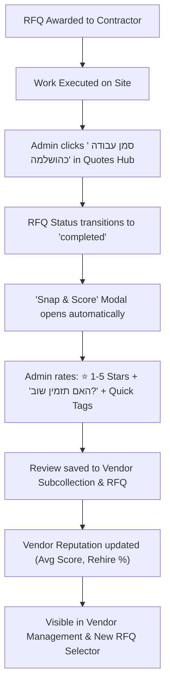

# PRD: TikTak Contractor Rating, Feedback & RFQ Completion Lifecycle
## סגירת מכרז, דירוג קבלנים ("Snap & Score") ומוניטין ספקים במערכת

**Document Status**: Approved Product Specification (v1.0)  
**Version**: 1.0.0  
**Author**: TikTak Lead Product Manager (TikTak-PM) & Lead Architect  
**Stakeholder & Quality Gatekeeper**: Oren Bodner (Lead Architect & Senior QA Lead)  
**Target Modules**:
1. Quotes Hub & Matrix (`/admin/:tenantId/quotes`) — `ActiveQuotesPage.tsx`
2. Ticket Management & Kanban (`/admin/:tenantId/dashboard`) — `AdminDashboard.tsx`
3. Vendor Directory & Settings (`/admin/:tenantId/settings/users`) — `VendorManagement.tsx`
4. New RFQ Creation Wizard (`/admin/:tenantId/quotes/new`) — `NewRfqPage.tsx`
**Date**: October 2026  

---

## 1. Executive Summary & Problem Statement

### 1.1 The Business Need
In property management and building maintenance, procuring work from external contractors is only half the battle. Once an RFQ (Request for Quotation) is **awarded** (`awarded`), administrators need a clear operational workflow to:
1. **Track job execution and mark it finished**: Currently, the RFQ lifecycle stops at `awarded`. There is no visual status or button for **"סמן עבודה כהושלמה" (Mark Work as Completed)**. As a result, admins cannot differentiate between active ongoing work and successfully delivered jobs.
2. **Build an internal contractor track record**: Property managers, building committees (Vaad), and management companies (Fleets) repeatedly ask: *"Did this electrician arrive on time last month? Was the plumbing work clean? Would we rehire them?"* Currently, this institutional knowledge is trapped in committee members' heads or lost in chat logs.
3. **Select high-performing contractors with confidence**: When creating a new RFQ, admins see a flat list of contractor names and phone numbers without any performance signal or historical quality indicator.

### 1.2 The Strategy: "Admin-Only Snap & Score"
Rather than introducing complex resident surveys (which add noise, subjective complaints, or violate TikTak's 15-second zero-login principle for residents), TikTak adopts an **Admin-Only Reputation System**:
- **Trigger**: Occurs naturally at the moment of job completion ("סמן עבודה כהושלמה").
- **Speed**: Built around the **"Snap & Score"** 2-action paradigm (Stars + Would Rehire + Submit in under 8 seconds).
- **Impact**: Aggregates directly into the Vendor's Card in Settings and renders as trust badges next to vendor checkboxes in the New RFQ Wizard.

---

## 2. Core Personas & User Flow



---

## 3. Core Functional Pillars

### 3.1 Pillar 1: RFQ Completion Lifecycle ("סמן עבודה כהושלמה")

#### 3.1.1 Location & UX in Quotes Hub (`ActiveQuotesPage.tsx`)
- On every RFQ card whose current status is `awarded`:
  - Provide a prominent action button: **"סמן עבודה כהושלמה"** (Mark Work as Completed) with a checkmark icon (`CheckCircle2`).
  - Visual styling: High-contrast success green or solid primary blue (`bg-emerald-600 hover:bg-emerald-700 text-white font-medium px-4 py-2 rounded-xl shadow-sm`).
  - Position: Inside the action row alongside "צפה בהצעות" and "WhatsApp".
- Clicking the button:
  1. Displays a lightweight confirmation / completion prompt.
  2. Updates RFQ document:
     - `status: 'completed'`
     - `completedAt: ISO string`
     - `completedBy: { uid: string, name: string }`
  3. Moves the RFQ visually into the **"הושלמו" (Completed)** tab or filter.
  4. **Immediately triggers the "Snap & Score" Rating Modal** for the winning contractor.

#### 3.1.2 Secondary Trigger from Ticket Dashboard (`AdminDashboard.tsx`)
- When a ticket has a linked awarded RFQ:
  - If the admin drags or sets the ticket status to `טופל` (Resolved), a dialog asks:  
    *"המכרז המשויך לקבלן {שם הקבלן} עדיין פתוח. האם לסמן גם את עבודת הקבלן כהושלמה?"*
  - If confirmed, marks the RFQ `completed` and pops up the rating modal.

#### 3.1.3 "הושלמו" RFQ Card State
- For RFQs with `status: 'completed'`:
  - Badge: `הושלם בהצלחה` (Emerald pill).
  - If already rated: Displays the star rating on the card (e.g. `⭐ 5/5 • "עבודה מקצועית"`) with a secondary link: **"ערוך דירוג"** (Edit Rating).
  - If not yet rated (e.g., admin dismissed modal): Displays an amber reminder button: **"דרג קבלן"** (Rate Contractor ⭐).

---

### 3.2 Pillar 2: "Snap & Score" Frictionless Micro-Survey

The rating modal is strictly designed around TikTak's **Montessori Minimalism** and **Radical Simplicity (5-to-2 Rule)**. An admin must be able to complete it in 2 clicks.

#### Modal Layout & Components
1. **Header**:
   - Title: `דירוג ביצוע עבודה — {שם הקבלן}`
   - Subtitle: `{כותרת המכרז} • סכום שנסגר: ₪{סכום ההצעה}`
2. **Action 1 — Star Rating (1 to 5 Stars)**:
   - Large, interactive star icons (min 44x44px touch targets).
   - Tooltip / dynamic label:
     - 1 Star: *גרוע מאוד*
     - 2 Stars: *טעון שיפור*
     - 3 Stars: *בינוני / בסדר*
     - 4 Stars: *טוב מאוד*
     - 5 Stars: *מצוין, מעל המצופה*
3. **Action 2 — "האם תזמין אותו שוב?" (Would you rehire?)**:
   - Two toggle buttons / pills:
     - `👍 כן, בהחלט` (Yes, definitely) — Green active state.
     - `👎 לא` (No) — Red/Slate active state.
   - Defaults to `👍 כן` if stars >= 4.
4. **Quick Tags (1-click multiselect pills)**:
   - Positive tags:
     - `⏰ עמידה בזמנים` (Punctual)
     - `🛠️ מקצועיות גבוהה` (High Quality Work)
     - `💰 מחיר הוגן` (Fair Price)
     - `🧹 נקי ומסודר` (Clean Worksite)
     - `📞 תקשורת מצוינת` (Great Communication)
   - Constructive/Warning tags (active if stars <= 3):
     - `⌛ איחור בביצוע` (Late)
     - `📈 ניסיון לייקר מחיר` (Price Creep)
     - `🚯 השאיר לכלוך` (Messy)
     - `🔇 לא זמין בטלפון` (Unresponsive)
5. **Optional Note (Free text)**:
   - Single textarea (max 200 chars): *"הערה פנימית לוועד / מנהלי הבניין (אופציונלי)"*.
6. **Footer Actions**:
   - Primary: **"שמור דירוג וסגור"** (`bg-blue-600 hover:bg-blue-700 text-white font-bold`).
   - Secondary / Skip: **"דלג כעת"** (Allows completing the RFQ without forcing an immediate review).

---

### 3.3 Pillar 3: Vendor Reputation in Vendor Management (`VendorManagement.tsx`)

#### 3.3.1 Vendor Card Badges
In **הגדרות -> ניהול ספקים**, each vendor card displays:
- **Reputation Pill**:
  - If reviewed: `⭐ 4.8 (6 עבודות) • 100% יזמינו שוב` (Gold star, slate text).
  - If no reviews yet: `טרם נצבר דירוג` (Muted slate).
- **Top Tags**: Up to 3 most frequently received tag pills (e.g. `עמידה בזמנים`, `מקצועיות גבוהה`).

#### 3.3.2 Drill-Down: "היסטוריית עבודות ודירוגים" Drawer / Modal
Clicking on the rating badge or a dedicated "היסטוריה" button opens a detailed timeline:
- **Lifetime Metrics**:
  - Total RFQs completed.
  - Overall Average Rating (1.0 - 5.0).
  - Rehire Rate (% of jobs where admin answered "Yes").
- **Review List**:
  - Card for each completed RFQ:
    - RFQ Title & Date.
    - Final awarded amount.
    - Stars awarded.
    - Rehire verdict (`👍 יזמין שוב` / `👎 לא יזמין שוב`).
    - Tags awarded.
    - Internal comment written by the admin.
    - Name of admin who submitted the review.

---

### 3.4 Pillar 4: Reputation in New RFQ Creation (`NewRfqPage.tsx`)

When the admin selects contractors to dispatch an RFQ to:
- Each checkbox in the vendor selection list includes their live reputation summary inline:
  ```text
  [✓] א.א. אינסטלציה (יוסי כהן)
      ⭐ 4.9 (8 עבודות) • 100% Rehire • עמידה בזמנים, מקצועיות גבוהה
  ```
- If a vendor has a low rating (< 3.0) or low rehire rate (< 50%), a subtle warning indicator appears:
  ```text
  [ ] שירותי חשמל בע"מ
      ⚠️ ⭐ 2.4 (3 עבודות) • 33% Rehire • איחור בביצוע
  ```
- Benefit: Prevents dispatching tenders to contractors who have repeatedly delivered poor service in past jobs for the building or fleet.

---

## 4. Technical Architecture & Data Schema

### 4.1 TypeScript Types (`frontend/src/types/rfq.ts`)

```typescript
export type RfqStatus = 'draft' | 'open' | 'awarded' | 'completed' | 'expired' | 'cancelled';

export interface RfqRating {
  stars: number; // 1 to 5
  wouldRehire: boolean;
  tags: string[];
  comment?: string;
  ratedAt: string; // ISO String
  ratedBy: {
    uid: string;
    name: string;
  };
}

export interface Rfq {
  // Existing fields...
  id: string;
  tenantId: string;
  status: RfqStatus;
  awardedVendorId?: string;
  awardedQuoteId?: string;
  
  // New Completion & Rating fields:
  completedAt?: string;
  completedBy?: {
    uid: string;
    name: string;
  };
  rating?: RfqRating;
}
```

### 4.2 Vendor Schema (`frontend/src/types/vendor.ts`)

```typescript
export interface VendorRatingSummary {
  averageScore: number;    // e.g. 4.8
  totalReviews: number;    // e.g. 10
  rehireCount: number;     // e.g. 9
  rehirePercentage: number;// e.g. 90
  topTags: string[];       // Top 3 most frequent tags
  lastRatedAt: string;     // ISO String
}

export interface VendorReview {
  id: string;              // rfqId
  rfqId: string;
  rfqTitle: string;
  score: number;           // 1 to 5
  wouldRehire: boolean;
  tags: string[];
  comment?: string;
  ratedAt: string;
  ratedBy: {
    uid: string;
    name: string;
  };
}

export interface Vendor {
  id: string;
  tenantId: string;
  name: string;
  companyName?: string;
  phone: string;
  category: string;
  ratingSummary?: VendorRatingSummary;
}
```

### 4.3 Firestore Storage Structure & Multi-Tenancy

All collections and subcollections remain strictly scoped under the tenant root to prevent any cross-tenant data leaks:

```text
tenants/{tenantId}/
  ├── rfqs/{rfqId}
  │     ├── status: 'completed'
  │     ├── completedAt: '2026-10-03T...'
  │     ├── rating: { stars: 5, wouldRehire: true, ... }
  │
  └── vendors/{vendorId}
        ├── ratingSummary: { averageScore: 4.8, totalReviews: 5, ... }
        └── reviews/{rfqId}   <-- Subcollection storing individual job reviews
              ├── score: 5
              ├── wouldRehire: true
              ├── tags: ['עמידה בזמנים', 'מקצועיות גבוהה']
              └── comment: '...'
```

### 4.4 Atomic Calculation Logic
When an admin submits a review:
1. Write/update the `rating` object on `tenants/{tenantId}/rfqs/{rfqId}`.
2. Write the review document to `tenants/{tenantId}/vendors/{vendorId}/reviews/{rfqId}`.
3. Compute the new `ratingSummary`:
   - `totalReviews = previousTotal + 1` (or same if editing).
   - `averageScore = sum(allScores) / totalReviews` rounded to 1 decimal place.
   - `rehirePercentage = Math.round((rehireCount / totalReviews) * 100)`.
   - Update `topTags` based on frequency count.
4. Performed via a batch write or a lightweight cloud helper to guarantee data consistency.

---

## 5. User Stories & Acceptance Criteria (Senior QA Approved)

| # | User Story | Scenario / Test Case | Expected Result |
|---|---|---|---|
| **1** | As an Admin, I want to mark an awarded RFQ as completed | In `ActiveQuotesPage.tsx`, click "סמן עבודה כהושלמה" on an `awarded` RFQ card | RFQ status updates to `'completed'`, `completedAt` is recorded, toast appears, and the "Snap & Score" modal opens immediately. |
| **2** | As an Admin, I want to rate the winning contractor in under 10 seconds | Rating modal is open: Admin selects 5 stars, thumbs up, clicks "עמידה בזמנים", and clicks "שמור דירוג" | Review is saved to RFQ and Vendor subcollection; Vendor's `ratingSummary` is recomputed; modal closes with positive feedback. |
| **3** | As an Admin, I can skip rating if in a hurry | In the completion modal, click "דלג כעת" | RFQ remains `completed`. A "דרג קבלן" button remains on the completed card for future rating. |
| **4** | As an Admin, I want to see vendor ratings when creating a new RFQ | Open `/admin/:tenantId/quotes/new`, scroll to contractor selection | Vendors display `⭐ {avg} ({count}) • {rehire}%` alongside their names. Unrated vendors show clean neutral placeholder. |
| **5** | As an Admin, I want to review all past performance of a vendor | Go to `Settings -> Users/Vendors`, click on vendor's rating badge | A drawer opens showing full job history: past RFQ titles, dates, scores, tags, and internal notes. |
| **6** | As a QA Auditor, I must verify tenant isolation | Attempt to query or write reviews for Vendor of Tenant A using Tenant B context | Operation rejected by Firestore Security Rules. No cross-tenant leakage. |
| **7** | As an Admin, I want to edit a previously submitted rating | On a completed RFQ card, click "ערוך דירוג" | Rating modal loads with existing stars and comment pre-filled; submitting updates the existing review and recalibrates the summary without double-counting reviews. |

---

## 6. Non-Goals & Prohibited Patterns
- **No Resident-Facing Ratings**: Residents do not rate RFQs. TikTak reporting remains 100% zero-login and anonymous.
- **No Public/External Vendor Yelp**: Ratings are private to the tenant / fleet management committee. Contractors cannot see other contractors' internal ratings.
- **No Mandatory 10-Question Surveys**: Never force more than 2 required inputs (Stars + Rehire verdict). Free text is strictly optional.

---

## 7. Metrics for Success
- **Adoption Rate**: > 80% of awarded RFQs marked `completed` receive an admin score within 24 hours.
- **Time to Rate**: Median completion time of the rating modal is < 10 seconds.
- **Procurement Confidence**: Over 65% of repeat RFQs are awarded to vendors with a >= 4.5 star rating and >= 90% rehire rate.
