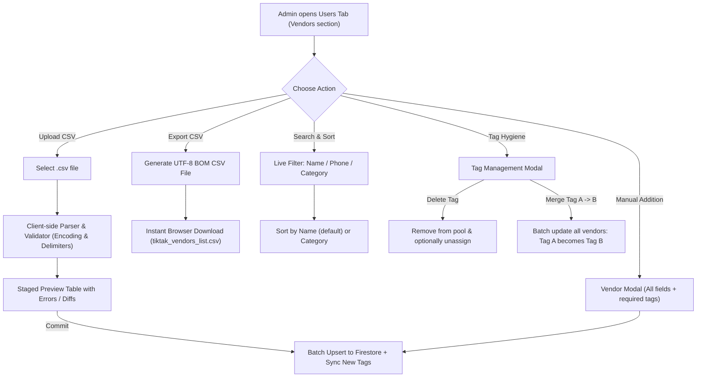

# PRD: TikTak Vendor Directory Redesign & Bulk Management Lifecycle
## ניהול קבלנים וספקים מתקדם: ייבוא/ייצוא CSV, חיפוש, מיון וניהול תגיות

**Document Status**: Approved Product Specification (v1.0)  
**Version**: 1.0.0  
**Author**: TikTak Lead Product Manager (TikTak-PM) & Feature Architect  
**Stakeholder & Quality Gatekeeper**: Oren Bodner (Lead Architect & Senior QA Lead)  
**Target Module**: `/admin/:tenantId/settings/users` — `VendorManagement.tsx` (Vendors section in Users Tab)  
**Date**: October 2026  

---

## 1. Executive Summary & Problem Statement

### 1.1 The Business Need
In TikTak, managing an up-to-date, structured directory of certified contractors and service providers is essential for rapid RFQ dispatches, work orders, and reputation tracking. 
Currently, the **Vendors section** (`VendorManagement.tsx`) allows only manual one-by-one addition via modal, with a fixed low ceiling (25 vendors), no search or filtering, and no bulk import/export mechanism.
In contrast, the **Residents Whitelist section** (`CsvUploadPanel.tsx`) offers a clean, robust, and highly intuitive administration pattern featuring:
- Bulk CSV upload with real-time parsing, validation, and staged preview before commit.
- Instant CSV export with UTF-8 BOM encoding for seamless Excel compatibility in Hebrew.
- Real-time search by multiple attributes.
- Clean header density, statistics, and inline controls.

Administrators of large buildings and multi-tenant fleets need the exact same powerful experience for their contractor database, with additional domain-specific capabilities for contractor categorization (Tags) and fleet scalability.

### 1.2 Core Objectives & The 5-to-2 Rule
1. **Consistency**: Replicate the look, feel, and interaction patterns of the Residents Whitelist section in the Vendors section.
2. **Bulk Velocity**: Enable property managers to upload or export 80–150 contractors via a single CSV file in seconds.
3. **Structured Taxonomy**: Enforce standard mandatory fields (Vendor Type: Retainer vs Temp, Full Name, Phone, Tags with `|` pipe delimiter).
4. **Autonomous Tag Expansion**: Any new tags introduced in CSV imports or manual additions are automatically registered in the tenant's category pool.
5. **Tag Lifecycle Governance**: Provide administrative tools to **delete** obsolete tags or **merge** synonymous tags across the entire vendor directory.
6. **Fleet-Grade Scale**: Expand capacity limits to **80 records** for single buildings and **150 records** for fleet management.

---

## 2. User Personas & Core Workflows

### 2.1 Personas
* **Building Committee Member (Vaad)**: Manages 20–50 local contractors for a residential tower; needs fast search by trade (e.g., "חשמל") and simple manual additions or CSV backups.
* **Fleet / Property Management Company Admin**: Manages up to 150 regional contractors across multiple residential complexes; needs bulk CSV onboarding from company ERP/Excel, centralized tag hygiene, and contractor export.

### 2.2 Fleet Governance Architecture (Strict Master Control & Shared Pool) — **IMPLEMENTED**
In a Multi-Building Fleet setup (`isPoolMaster` / `usesParentPool`):
1. **Shared Enterprise Pool**: The Fleet Master (Parent Enterprise) maintains the centralized certified vendor repository of up to **150 contractors** (`tenants/{parentEnterpriseId}/vendors`).
2. **Child Building Inheritance**: Child buildings (`usesParentPool: true`) automatically inherit and read from the parent's vendor directory for both RFQ dispatches and vendor lookups.
3. **Role & Permission Isolation**:
   - **Fleet Master Admin**: Full Read/Write controls (Upload CSV, Add/Edit/Delete vendors, Manage/Merge tags). Quota displayed: `150`.
   - **Child Building Admin**: **Read-Only access** in the Vendors directory. Child admins can search, filter, export CSV, and view rating reviews. Destructive actions (`Upload CSV`, `Add Vendor`, `Edit`, `Delete`, `Manage Tags`) are hidden and protected with validation guards.
   - **Cross-Fleet Rating Sync**: When a child building rates a vendor following an RFQ closure, `vendorReviewService.ts` automatically resolves `parentEnterpriseId` and updates the vendor's reviews and aggregate rating summary in the fleet pool, benefiting all buildings.

### 2.2 System Architecture & Flow

---

## 3. Data Specification & File Contracts

### 3.1 Vendor Record Schema (Firestore: `tenants/{tenantId}/vendors/{vendorId}`)

| Field Name | Type | Mandatory? | Description & Constraints |
| :--- | :--- | :--- | :--- |
| `vendorType` | `'retainer' \| 'occasional'` | **Yes** | `1` = Retainer (ספק קבוע), `0` = Temp/Occasional (קבלן מזדמן) |
| `fullName` | `string` | **Yes** | 2–50 characters, letters, numbers, hyphens |
| `phone` | `string` | **Yes** | Normalized mobile/phone (starts with `0` or `+`, 9–15 digits) |
| `categories` | `string[]` | **Yes** | At least 1 tag. In CSV: delimited by `\|` (pipe) |
| `email` | `string` (optional) | No | Valid email format if provided |
| `companyId` | `string` (optional) | No | ח.פ. / ת.ז. / עוסק מורשה (up to 20 chars) |
| `notes` | `string` (optional) | No | Free-text administrative notes |
| `ratingSummary` | `VendorRatingSummary` | No | Preserved automatically on updates/imports |
| `createdAt` | `string` (ISO) | Auto | Timestamp created |
| `updatedAt` | `string` (ISO) | Auto | Timestamp updated |

### 3.2 CSV Header Mapping & Aliases

The importer and exporter recognize standard Hebrew and English headers. Rating metrics are split into **four dedicated distinct columns** rather than combined into a single cell, ensuring clean spreadsheet manipulation and zero parsing ambiguity.

| Canonical Field | Hebrew Headers Recognized | English Headers Recognized | Sample Valid Value | Status / Behavior |
| :--- | :--- | :--- | :--- | :--- |
| **Vendor Type** | `סוג ספק`, `סוג`, `קבוע/מזדמן`, `קבוע` | `vendorType`, `type`, `isRetainer` | `1`, `0`, `קבוע`, `מזדמן`, `retainer`, `temp` | **Mandatory** (`1` = Retainer, `0` = Temp) |
| **Full Name** | `שם מלא`, `שם`, `שם קבלן` | `fullName`, `name`, `vendorName` | `יוסי כהן - אינסטלציה` | **Mandatory** (2–50 chars) |
| **Phone** | `טלפון`, `נייד`, `מספר טלפון`, `סלולרי` | `phone`, `mobile`, `tel` | `0521234567` או `+972521234567` | **Mandatory** (Digits only or leading `+`, hyphens stripped) |
| **Tags / Categories** | `תגיות`, `קטגוריות`, `תחום`, `מקצוע` | `tags`, `categories`, `profession` | `אינסטלציה\|משאבות\|ביוב` | **Mandatory** (At least 1 tag; pipe `\|` delimited) |
| **Email** | `אימייל`, `דוא"ל`, `מייל` | `email`, `mail` | `yossi@plumber.co.il` | Optional |
| **Company ID** | `ח.פ/ת.ז`, `ח.פ`, `ת.ז`, `מספר חברה` | `companyId`, `taxId`, `idNumber` | `515432109` | Optional |
| **Notes** | `הערות`, `הערה` | `notes`, `comments` | `זמין לקריאות חירום 24/7` | Optional |
| **Average Rate** | `ציון ממוצע`, `דירוג ממוצע`, `ציון` | `averageRating`, `rating`, `score` | `4.8` | Read-only in import / Exported from rating summary |
| **Total Jobs** | `סה"כ עבודות`, `מספר עבודות`, `עבודות` | `totalJobs`, `jobsCount`, `jobs` | `12` | Read-only in import / Exported from rating summary |
| **Rehire Rate** | `אחוז הזמנה חוזרת`, `הזמנה חוזרת`, `חזרה לספק` | `rehireRate`, `rehire`, `rehirePercentage` | `92%` או `92` | Read-only in import / Exported from rating summary |
| **Leading Advantages**| `יתרונות בולטים`, `יתרונות`, `תגיות מובילות` | `leadingAdvantages`, `advantages`, `topTags` | `מקצועי ואדיב\|מחיר הוגן` | Read-only in import / Pipe `\|` delimited |

> [!IMPORTANT]
> **Delimiter & Format Rules**:
> 1. **Strict Comma Delimiter Only**: The CSV importer supports strictly standard comma (`,`) delimited files. Semicolons (`;`) and tabs (`\t`) are **NOT** supported.
> 2. **Delimiter Rules for Multi-Value Tags**: Multiple tags within a single CSV cell MUST be divided by the pipe character (`|`). Example: `חשמל|מיזוג אוויר|אינטרקום`. Spaces surrounding pipes are automatically trimmed.
> 3. **Strict Phone Number Formatting**: Phone numbers are formatted to digits only, or a leading `+` followed by digits only. All hyphens (`-`), spaces, parentheses, dots, and non-numeric characters are automatically stripped upon import and manual entry.
> 4. **Rating Summary Handling**: When exporting, the 4 rating headers are generated from the vendor's reputation data. When importing, these 4 headers are accepted as read-only / metadata columns so that re-importing exported CSV files operates without errors and does not overwrite live Firestore review data.

---

## 4. Functional Requirements

### 4.1 Requirement 1: CSV Upload & Staged Import Panel
1. **File Input**: Accept `.csv` or comma-separated plain text.
2. **Encoding & Delimiter Handling**: Automatically detect UTF-8, Windows-1255, ISO-8859-8, and UTF-16. **Strictly support comma (`,`) only**. If the file is not comma-separated, reject it with a clear explanatory error: `"הקובץ אינו מופרד בפסיקים. TikTak תומך בקבצי CSV מופרדים בפסיקים (,) בלבד."`
3. **Strict Phone Normalization**: Automatically normalize all phone inputs to numbers only or a leading `+` at the head (e.g. `052-1234567` becomes `0521234567`, `+972-52-123-4567` becomes `+972521234567`). Strip all hyphens, spaces, and formatting.
4. **Staged Preview (Like Whitelist)**:
   - Upon upload, do NOT immediately write to the database.
   - Show a staged preview card with count of parsed vendors.
   - Validate each row: check mandatory fields (`vendorType`, `fullName`, `phone`, `tags`).
   - If errors exist, list exact row numbers and descriptions.
   - Provide two action buttons: **"שמור למסד הנתונים" (Save to Database)** and **"ביטול" (Cancel)**.
5. **Smart Upsert (Identity Preservation)**:
   - When committing to Firestore, match existing vendors by normalized phone number.
   - If phone exists: update existing vendor document (preserving document ID, review history subcollection, and rating aggregates).
   - If phone is new: create a new vendor document.
6. **Automatic Tag Ingestion**: Any tag in the CSV that is not in the tenant's category pool is immediately added to `config.categories` and local pool.
7. **Quota Enforcement & Prominent Counter**:
   - Single tenant: Max 80 total records.
   - Fleet tenant: Max 150 total records.
   - Display total number of vendors prominently in header badge (e.g., `סה"כ ספקים: 34 מתוך 80` או `34 / 150`).
   - If the uploaded file would cause the total to exceed the limit, block the commit and display: `"הקובץ חורג מהמכסה המרבית (X/80 לספק יחיד, X/150 לצי)"`.

### 4.2 Requirement 2: CSV Export (UTF-8 with BOM & Split Rating Headers)
1. Triggered by a dedicated **"הורדה" (Download)** button in the header (identical in icon and style to `CsvUploadPanel.tsx`).
2. Generates CSV string containing all current fields for all vendors, including the 4 split rating columns (`ציון ממוצע`, `סה"כ עבודות`, `אחוז הזמנה חוזרת`, `יתרונות בולטים`).
3. Prefixes the file with UTF-8 BOM (`\uFEFF`) to guarantee immediate Hebrew readability in Excel without encoding dialogs.
4. Download file name: `tiktak_vendors_list.csv`.

### 4.3 Requirement 3: Multi-Field Real-Time Search & Vendor Counters
1. Dedicated search input bar with search icon (`Search`) and clear button (`X`).
2. Case-insensitive, real-time filtering across:
   - Vendor full name (`fullName`)
   - Vendor phone number (`phone`)
   - Any tag/category in `categories`
   - Company ID (`companyId`)
3. Renders result count feedback prominently: `"מציג X מתוך Y ספקים"` (and indicates overall quota).

### 4.4 Requirement 4: List Sorting
1. Default sort: **שם מלא (א-ת)** (Alphabetical by Full Name in Hebrew).
2. Sorting options dropdown/toggle:
   - **לפי שם (א-ת)**
   - **לפי קטגוריה ראשית (א-ת)**
   - **לפי סוג (ספקים קבועים תחילה)**
   - **לפי דירוג (גבוה לנמוך)**

### 4.5 Requirement 5: Manual Contractor Addition Modal
1. Maintain the current modal trigger button **"הוסף איש שירות חדש"** (`UserPlus`).
2. Enforce the mandatory fields:
   - `vendorType`: Toggle between ספק קבוע (Retainer) and קבלן מזדמן (Temp/Occasional).
   - `fullName`: Required, max 50 chars.
   - `phone`: Required, Israeli mobile/landline regex.
   - `categories` (Tags): Required, at least 1 tag selected.
3. Allow inline custom tag addition: adding a new tag immediately checks it and updates the tenant pool.
4. Support editing existing vendor records with the same modal.

### 4.6 Requirement 6: Tag Management (Delete & Merge Governance)
1. Provide a **"ניהול תגיות" (Manage Tags)** action button next to the search/filters.
2. Clicking opens the **Tag Governance Modal**:
   - Lists all registered tags with a badge showing how many vendors currently hold each tag.
   - **Action A: Delete Tag (מחיקה)**:
     - Prompts confirmation: *"מחיקת תגית זו תסיר אותה מרשימת הקטגוריות ומ-X קבלנים שמשויכים אליה. להמשיך?"*
     - Removes the tag from `tenant.config.categories`.
     - Batch-updates all vendors having this tag to remove it from their `categories` array.
   - **Action B: Merge Tag (מיזוג תגית לתוך תגית אחרת)**:
     - Allows selecting a Source Tag (e.g. `אינסטלטור`) and a Target Tag (e.g. `אינסטלציה`).
     - Updates all vendors who possess the Source Tag: replaces the Source Tag with the Target Tag (deduplicating if the vendor already had both).
     - Deletes the Source Tag from `tenant.config.categories`.
     - Ensures Target Tag is present in `tenant.config.categories`.
     - Atomic Firestore batch commit.
     - Logs `TAG_MERGED` in audit log with source and target details.

---

## 5. UI/UX & Visual Design Tokens (Adhering to `CsvUploadPanel`)

### 5.1 Container & Header Hierarchy
- Main Card: `bg-white rounded-xl shadow-sm border border-slate-200 p-6` (matching `CsvUploadPanel`).
- Section Header:
  - Blue rounded icon: `Wrench` or `Users` (`text-blue-600 bg-blue-50 p-2 rounded-xl border border-blue-100`).
  - Title: **קבלנים וספקים מורשים** with count badge: `X / 80` (or `X / 150` for fleet).
  - Header actions:
    1. **הורדה (Download CSV)**: `px-3 py-1.5 bg-slate-100 hover:bg-slate-200 text-slate-700 rounded-lg text-xs font-bold`
    2. **העלאה (Upload CSV)**: `px-3 py-1.5 bg-blue-600 hover:bg-blue-700 text-white rounded-lg text-xs font-bold`
    3. **ניהול תגיות (Manage Tags)**: `px-3 py-1.5 bg-indigo-50 hover:bg-indigo-100 text-indigo-700 border border-indigo-200 rounded-lg text-xs font-bold`

### 5.2 Controls Bar
- Search Input: Full-width or flexible `px-9 py-2 border border-slate-200 rounded-lg font-bold text-xs`.
- Sort Selector: Compact select dropdown (`bg-slate-50 border border-slate-200 text-xs font-bold rounded-lg px-2.5 py-2`).
- Add Vendor Button: Direct button `+ הוסף איש שירות`.

---

## 6. Senior QA Acceptance Criteria & Test Matrix

| ID | Test Scenario | Expected Result | Pass/Fail Gate |
| :--- | :--- | :--- | :--- |
| **TC-01** | Upload valid CSV with 15 vendors, pipe-separated tags, and mixed retainer/temp types | Parses 15 records into Staged Preview, identifies headers in Hebrew or English, shows 0 errors | **P0 (Blocker)** |
| **TC-02** | Upload CSV with missing mandatory phone or tag | Highlights offending row numbers with Hebrew error description; blocks database save | **P0 (Blocker)** |
| **TC-03** | Upload CSV containing new tags not in pool (e.g. `איטום בריכות`) | On save, vendors are created AND `איטום בריכות` is auto-added to `config.categories` | **P0 (Blocker)** |
| **TC-04** | Single tenant uploads 85 vendors (quota is 80) | Importer detects quota breach (85 > 80) and displays clear limitation alert | **P0 (Blocker)** |
| **TC-05** | Fleet tenant uploads 140 vendors (quota is 150) | Fleet detection succeeds (`isFleet = true`), allows import up to 150 records | **P0 (Blocker)** |
| **TC-06** | Export vendors to CSV | Downloads `tiktak_vendors_list.csv` with UTF-8 BOM; opens cleanly in Excel without gibberish | **P0 (Blocker)** |
| **TC-07** | Search by name, phone, or category tag | Live list updates instantly; clear button (X) resets the search | **P1 (Critical)** |
| **TC-08** | Sort list by Category vs Name | Order flips correctly between Hebrew alphabetical name and primary category | **P1 (Critical)** |
| **TC-09** | Tag Merge: Merge `ברזים` into `אינסטלציה` | All vendors with `ברזים` now have `אינסטלציה`; `ברזים` removed from pool; audit logged | **P0 (Blocker)** |
| **TC-10** | Tag Delete: Delete unused tag | Tag removed from pool and tenant config | **P1 (Critical)** |
| **TC-11** | Upsert by Phone: Import CSV with updated email/tags for existing vendor phone | Existing vendor document updated in place; review subcollection and ratings preserved | **P0 (Blocker)** |
