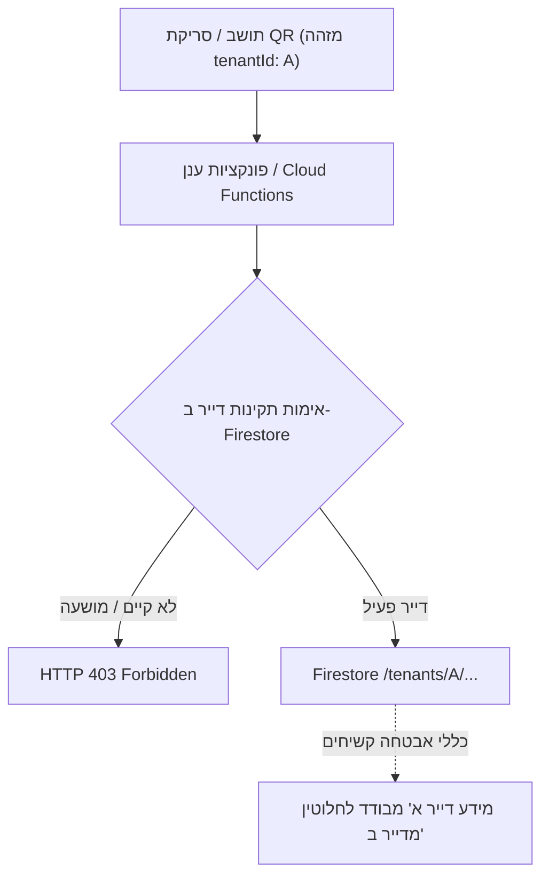
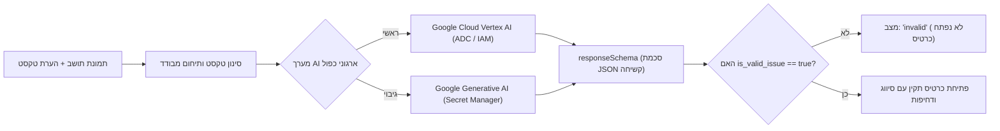

# טיק-טק (TikTak) — מפרט אבטחה, הגנות והקשחת מערכת

## 1. תקציר מנהלים וארכיטקטורה כללית

**טיק-טק (TikTak)** הינה פלטפורמה ארגונית מבוססת Serverless לניהול תקלות, תחזוקת מבנים ודיווחים מוניציפליים הפועלת על גבי Google Cloud Platform (GCP) ו-Firebase. המערכת מגשרת בין **חוויית דיווח מהירה ללא חיכוך עבור התושב** (תהליך של מתחת ל-15 שניות ללא צורך בהרשמה, סיסמה או הורדת אפליקציה) לבין **תפיסת הגנה לעומק (Defense-in-Depth)** מחמירה ובלתי מתפשרת.

מאחורי ממשק הדיווח הפשוט והמהיר פועלת תשתית ענן עוצמתית:
1. מודלי בינה מלאכותית מולטי-מודאליים (**Google Cloud Vertex AI** / **Gemini 2.5 Flash**) לזיהוי קטגוריה, תקצור אוטומטי של תקלות ועיבוד הודעות קוליות.
2. אחסון ענן מבודד ומאובטח לפי דייר (**Google Cloud Storage**) תחת הנתיב `/tenants/{tenantId}/`.
3. מנוע ווב-הוק לקליטה בזמן אמת של הודעות ווטסאפ (**Meta WhatsApp Cloud API**).

מסמך מפרט זה מפרט את ארכיטקטורת האבטחה המלאה, האימותים הקריפטוגרפיים, גבולות בידוד המידע בין בניינים ורשויות (Multi-Tenancy), מנגנוני מניעת ההתעללות (Anti-Abuse), וההגנות על מנועי ה-AI המוטמעים במערכת, המבטיחים חסינות מפני התקפות מניעת שירות כספיות (Denial-of-Wallet), חדירות מידע וזיוף פניות.

---

## 2. עקרונות יסוד: פשטות קיצונית מול אבטחה מקסימלית

1. **עיקרון "צלם ושלח" (חוק ה-5 ל-2)**: תושב מדווח על מפגע ב-2 פעולות בלבד: סריקת QR -> צילום. היעדר מסך כניסה, הרשמה וסיסמה הוא עיקרון מוצר יסודי מכוון ולא מחדל אבטחה.
2. **דיווח באפס ידע (Zero-Knowledge Reporting)**: המערכת אינה אוספת, אינה שומרת ואינה מעבדת פרטים מזהים (PII), סיסמאות או מספרי טלפון של התושב במסלול הדיווח הציבורי.
3. **הקשר מובנה מסריקת ה-QR**: כל הקשר הדיווח, ההרשאות והבידוד נגזר ישירות מה-`tenantId` הייחודי המשויך למיקום הפיזי שנסרק.
4. **יעילות וצמצום משאבים (Scale-to-Zero)**: כל מנגנוני האבטחה מתוכננים לפעול על גבי שירותי Serverless המתכנסים לאפס צריכה כאשר אין פעילות, במטרה לשמור על מודל רווחי וחסכוני.

---

## 3. הפרדת דיירים ובידוד נתונים מוחלט (Multi-Tenancy)



### 3.1 ארכיטקטורת מסד נתונים מופרדת
- **אוספי שורש מבודדים**: כל קריאה, הודעה, הגדרה והצעת מחיר מקבלנים נשמרים תחת `/tenants/{tenantId}/`. שאילתות רוחביות וגלובליות חוצות דיירים חסומות לחלוטין ברמת הארכיטקטורה.
- **אימות מורשי ניהול דייר (Admin UIDs)**: גישה לנתוני הניהול של הבניין מאומתת מול רשימת המנהלים המורשים במסמך:
  ```javascript
  function isTenantAdmin(tenantId) {
    return request.auth != null && (
      isSuperAdmin() || 
      request.auth.uid in get(/databases/$(database)/documents/tenants/$(tenantId)).data.adminUids
    );
  }
  ```
- **הרשאות מנהל-על (Super Admin Custom Claims)**: יכולות ניהול גלובליות מותנות באימות טוקן מאובטח קריפטוגרפית (`request.auth.token.role == 'super'`).

---

## 4. אבטחה והקשחת ממשקי קצה ו-APIs ציבוריים

נקודות הקצה הציבוריות (כדוגמת `/api/analyzeImage`) מוגנות מפני סקריפטים אוטומטיים והתקפות מניעת שירות כספיות באמצעות שכבות בקרה רבות בקובץ [functions/src/utils/securityGuards.ts](file:///c:/Users/orenb/OneDrive/Desktop/TikTak/functions/src/utils/securityGuards.ts):

### 4.1 הגבלת קצב בקשות מבוססת IP (Sliding-Window Rate Limiting)
- **סף הגבלה**: הגבלת פניות ניתוח תמונה עד מקסימום 15 קריאות לכל כתובת IP בחלון זמן מתגלגל של 5 דקות.
- **ניהול זיכרון בטוח**: מאגר הזיכרון מפנה אוטומטית רישומים ישנים כדי למנוע דליפות זיכרון ולשמור על מהירות עלייה (Cold Start) מהירה של פונקציות הענן.
- **תגובה בחריגה**: בקשות עודפות נדחות מידית עם קוד `HTTP 429 Too Many Requests`.

### 4.2 מגבלות גודל תוכן (Payload Size Guardrails)
- **בדיקה מקדימה לפני פענוח בזיכרון**: מחרוזת ה-Base64 נבדקת בגודלה לפני הקצאת זיכרון לבאפר.
- **אכיפה**: תוכן העולה על 5,000,000 תווים (~3.75MB נקי בינארי) נדחה מידית עם `HTTP 413 Payload Too Large`.

### 4.3 בדיקת בתים מזהים בינאריים (Magic-Byte Inspection)
- **אי-הסתמכות על כותרות לקוח**: המערכת מתעלמת מה-`Content-Type` שמצהיר הדפדפן ובודקת ישירות את הבתים הראשונים של הקובץ:
  - **JPEG**: `0xFF 0xD8 0xFF`
  - **PNG**: `0x89 0x50 0x4E 0x47 0x0D 0x0A 0x1A 0x0A`
  - **WebP**: `RIFF` (בתים 0–3) ... `WEBP` (בתים 8–11)
- **חסימת קוד עוין**: קובצי הרצה (.exe, .sh), דפי HTML, קובצי SVG המכילים סקריפטים, וקבצים בעלי מבנה מתחזה נחסמים מידית עם `HTTP 415 Unsupported Media Type`.

### 4.4 בדיקת זכאות מקדימה לדייר (Tenant Pre-Flight Validation)
- **סדר ביצוע מחמיר**: הפונקציה מאמתת את קיום מסמך הדייר ב-Firestore **לפני** שהיא מבצעת שמירה ב-Storage או מפעילה מודל AI יקר.
- **בדיקת מנוי פעיל**: אם הדייר אינו קיים, או שמצב המנוי שלו הוא `'frozen'` (מוקפא) או `'cancelled'`, הפנייה נחסמת מידית עם `HTTP 403 Forbidden`.

### 4.5 אימות Firebase App Check
- נקודות הקצה הציבוריות תומכות באימות אמינות מכשיר ודפדפן (`verifyAppCheckHeader`) לחסימת סורקים אוטומטיים ובוטים.

---

## 5. אבטחת מודלי בינה מלאכותית (AI) ומניעת התקפות



### 5.1 ארכיטקטורת מנוע כפול והרשאות ארגוניות (Vertex AI)
- **מנוע ראשי**: **Google Cloud Vertex AI** ארגוני (`@google-cloud/vertexai`) הפועל עם Application Default Credentials (ADC) והרשאות IAM מנוהלות של ה-Service Account (`roles/aiplatform.user`).
- **מנוע גיבוי**: **Google Generative AI** (`@google/generative-ai`) המשתמש במפתחות המאוחסנים באופן בלעדי ב-Google Cloud Secret Manager.

### 5.2 הגנה מפני הזרקת פקודות (Prompt Injection) ותיחום מבודד
- טקסט חופשי המוזן על ידי התושב מנוקה מתגיות HTML (`<` ו-`>`) ומוגבל לאורך של 500 תווים.
- הקלט של התושב מבודד בתוך תחמידים מוגדרים (`<<<RESIDENT_COMMENT>>>`) יחד עם הנחיות מערכת חד-משמעיות האוסרות על המודל לשנות את התנהגותו או לקבוע רמת דחיפות על פי בקשת המשתמש.

### 5.3 אכיפת סכמת פלט מובנית (Native responseSchema)
- מבנה הפלט נאכף ברמת ה-API של מודל ה-AI באמצעות `SchemaType.OBJECT`.
- נמנע הצורך בפיענוח מחרוזות מבוסס Regex, ונחסמות התקפות שיבוש מבנה נתונים.

### 5.4 שער אימות מפגע אמיתי (Incident Validity Gatekeeper)
- מודל ה-AI בוחן האם התמונה מכילה מפגע תחזוקתי או מוניציפלי ממשי (`is_valid_issue: boolean`).
- תמונות שאינן רלוונטיות (סלפי, חיות מחמד, בדיחות רשת) מסומנות ונחסמות מיצירת קריאות סרק המעמיסות על וועד הבית או המוקד.

---

## 6. אבטחת אחסון ענן (Cloud Storage) והגנה על קבצים בינאריים

מוגדר בקובץ [storage.rules](file:///c:/Users/orenb/OneDrive/Desktop/TikTak/storage.rules):
- **תקרת גודל קובץ**: מגבלה קשיחה של עד **6MB** לכל קובץ מועלה (`request.resource.size < 6 * 1024 * 1024`).
- **רשימה לבנה של סוגי תוכן (MIME Types)**:
  - מורשים: תמונות (`image/*`), אודיו (`audio/*`), וידאו (`video/*`), מסמכי PDF (`application/pdf`), וקובצי Microsoft Office.
  - אסורים: קובצי הרצה, סקריפטים פעילים (`.js`, `.html`, `.svg`), וקבצים בינאריים בלתי מוכרים.
- **בידוד נתיבי אחסון**: כל הקבצים נשמרים תחת נתיב הדייר המבודד `/tenants/{tenantId}/...`.

---

## 7. אימות קריפטוגרפי של Meta WhatsApp Webhook

מוגדר ב-[functions/src/utils/securityGuards.ts](file:///c:/Users/orenb/OneDrive/Desktop/TikTak/functions/src/utils/securityGuards.ts#L99):
- **אימות חתימת HMAC-SHA256**: פניות הנכנסות מווטסאפ (Meta) נבדקות לקיומה של כותרת `X-Hub-Signature-256`.
- **חישוב חתימה על הבאפר המקורי**: החתימה מחושבת מחדש על גבי `req.rawBody` באמצעות מפתח הסוד `WHATSAPP_APP_SECRET`.
- **עמידות בפני התקפות תזמון (Timing-Safe Equality)**: השוואת החתימות מתבצעת באמצעות `crypto.timingSafeEqual` למניעת התקפות סייד-צ'אנל. פניות מזויפות או חסרות חתימה נדחות ב-`HTTP 401 Unauthorized` עוד לפני עיבוד הודעות קוליות או תמונות.

---

## 8. יומני ביקורת (Audit Logs) וחסינות מחיקה

מוגדר בקובץ [firestore.rules](file:///c:/Users/orenb/OneDrive/Desktop/TikTak/firestore.rules):
- **אוסף ביקורת מרכזי**: כל פעולה ניהולית, שינוי סטטוס, הקצאת קבלן והתראת מכסה נרשמים באוסף `/audit_logs/{logId}`.
- **שמירה כחוק למשך 7 שנים**: כל רשומה כוללת שדה תפוגה `expireAt` המוגדר למשך 7 שנים קדימה.
- **חסינות מחיקה ושינוי (Immutability)**:
  ```javascript
  match /audit_logs/{logId} {
    allow create: if request.auth != null;
    allow read: if isSuperAdmin() || (request.auth != null && isTenantAdmin(resource.data.tenantId));
    allow update, delete: if false; // חסינות מוחלטת
  }
  ```
  אין לאף משתמש, מנהל או גורם חיצוני אפשרות לשנות או למחוק רשומות ביקורת היסטוריות.

---

## 9. ניהול סודות ותשתיות GCP

- **Google Cloud Secret Manager**:
  - כל המפתחות הסודיים (`WHATSAPP_ACCESS_TOKEN`, `WHATSAPP_APP_SECRET`, `WHATSAPP_VERIFY_TOKEN`, `GEMINI_API_KEY`) נמשכים בזמן ריצה ישירות מ-Secret Manager.
  - שום מפתח או סוד אינו נשמר בקוד ה-Git או חשוף בדפדפן הלקוח.
- **עקרון המינימום ההכרחי (Least Privilege IAM)**:
  - שירותי הענן רצים תחת Service Accounts ייעודיים עם הרשאות מינימליות מוגדרות בלבד (`roles/aiplatform.user`, `roles/datastore.user`, `roles/storage.objectAdmin`).
- **אבטחת הפצת תוכן (Hosting Security)**:
  - מוגדרות כותרות `Cache-Control: no-cache, no-store, must-revalidate` על נתיבי האפליקציה למניעת דליפת מידע במטמון ציבורי.

---

## 10. מטריצת איומים ומיפוי OWASP LLM

| קטגוריית איום | וקטור תקיפה | מנגנון ההגנה בטיק-טק | סטטוס |
| :--- | :--- | :--- | :--- |
| **OWASP LLM04: מניעת שירות למודל (DoW)** | סקריפט המציף את נקודת הקצה `/api/analyzeImage` | הגבלת קצב IP (עד 15 בקשות ב-5 דק') + מגבלת גודל 5MB | **פעיל ומאומת** |
| **OWASP LLM01: הזרקת פקודות (Prompt Injection)** | טקסט זדוני המנסה לשנות סיווג או רמת דחיפות | תיחום מבודד (`<<<RESIDENT_COMMENT>>>`) וסינון תגיות | **פעיל ומאומת** |
| **OWASP LLM05: חשיפת מפתחות וסודות** | מפתחות קבועים בקוד המערכת | Google Cloud Secret Manager + אימות ADC ארגוני | **פעיל ומאומת** |
| **הצפת אחסון (Storage Flooding)** | העלאת ג'יגה-בייטים של קבצים ל-Cloud Storage | בדיקת זכאות דייר מקדימה + מגבלת 6MB + בדיקת Magic-Bytes | **פעיל ומאומת** |
| **זיוף הודעות ווצאפ (Webhook Forgery)** | שליחת פניות מזויפות ישירות ל-Webhook | אימות קריפטוגרפי HMAC-SHA256 בעמידות Timing Attacks | **פעיל ומאומת** |
| **דליפת מידע בין דיירים** | משתמש מבניין א' מנסה לצפות בקריאות בניין ב' | אוספים מבודדים לפי tenantId + כללי Firestore ברמת UID | **פעיל ומאומת** |
| **הצפה בתמונות שאינן תקלה** | העלאת תמונות סלפי, חיות או תמונות פוגעניות | שער אימות תקלה במודל ה-AI (`is_valid_issue: false`) | **פעיל ומאומת** |
| **שיבוש יומני ביקורת** | מנהל מנסה למחוק תיעוד של פעולה לא תקינה | כלל `allow update, delete: if false` ושמירה ל-7 שנים | **פעיל ומאומת** |

---

*נכתב על ידי: צוות האבטחה וה-QA של טיק-טק (TikTak)*  
*פרויקט: tiktak2026*
