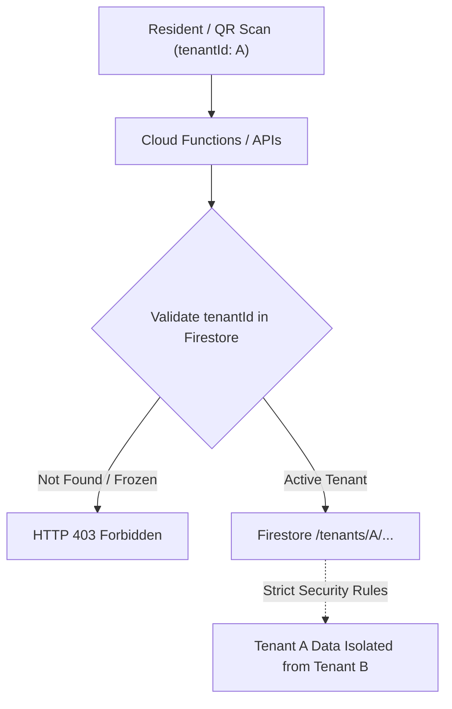
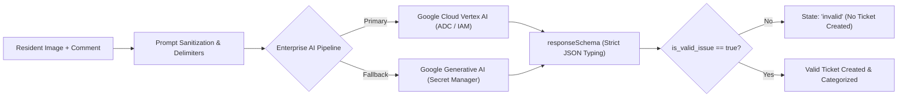

# TikTak — Comprehensive Security & Hardening Specification

## 1. Executive Summary & Architecture Overview

**TikTak** is an enterprise-grade, serverless maintenance and municipal incident reporting platform engineered to operate on Google Cloud Platform (GCP) and Firebase. The platform bridges the gap between **zero-friction resident reporting** (a sub-15-second flow requiring no user accounts, app downloads, or passwords) and **defense-in-depth security**.

Behind this streamlined reporting interface lies high-powered cloud infrastructure:
1. Multimodal AI inference (**Google Cloud Vertex AI** / **Gemini 2.5 Flash**) for automated categorization, summary generation, and voice-note processing.
2. Tenant-scoped cloud storage (**Google Cloud Storage**) under `/tenants/{tenantId}/`.
3. Inbound webhook processing (**Meta WhatsApp Cloud API**) for real-time reporting workflows.

This specification details the end-to-end security architecture, cryptographic verifications, data isolation boundaries, anti-abuse guardrails, and AI protections deployed in TikTak to prevent Denial-of-Wallet (DoW), unauthorized tenant access, prompt injection, and data leakage.

---

## 2. Core Philosophy: Radical Simplicity vs. High Security

1. **The 5-to-2 Action Rule ("Snap & Send")**: Residents submit maintenance issues in 2 simple actions: Scan QR Code -> Snap Photo. Eliminating resident logins and passwords is a conscious architectural choice, not an omission.
2. **Zero-Knowledge Reporting**: The platform does not collect, track, or persist resident PII (Personally Identifiable Information), passwords, or personal credentials during the public reporting flow.
3. **Implicit Context via Scanned QR**: All authorization and reporting context originates from the unique `tenantId` cryptographically embedded in the physical building or municipal location QR code.
4. **Scale-to-Zero Efficiency**: All security defenses are engineered to run on serverless primitives, adhering to the GCP scale-to-zero model to eliminate idle operating costs.

---

## 3. Multi-Tenancy & Hard Data Isolation



### 3.1 Partitioned Database Architecture
- **Strict Tenant Root Collections**: Every ticket, message, configuration, and contractor quote is strictly scoped under `/tenants/{tenantId}/`. Global, cross-tenant database queries are blocked by architecture.
- **Tenant Admin UID Verification**: Access to tenant data is validated against the document's authorized admin list:
  ```javascript
  function isTenantAdmin(tenantId) {
    return request.auth != null && (
      isSuperAdmin() || 
      request.auth.uid in get(/databases/$(database)/documents/tenants/$(tenantId)).data.adminUids
    );
  }
  ```
- **Super Admin Custom Claims**: Global administrative management is gated behind cryptographic Firebase Auth Custom Claims (`request.auth.token.role == 'super'`).

---

## 4. Inbound API & Public Endpoint Hardening

Public entry points (such as `/api/analyzeImage`) are guarded against automated scripts and Denial-of-Wallet attacks through multi-layered checks in [functions/src/utils/securityGuards.ts](file:///c:/Users/orenb/OneDrive/Desktop/TikTak/functions/src/utils/securityGuards.ts):

### 4.1 Sliding-Window IP Rate Limiting
- **Throttling Threshold**: Inbound calls are constrained to a maximum of 15 requests per IP address within a 5-minute sliding window.
- **Memory-Safe Eviction**: The in-memory rate-limiting store automatically evicts expired buckets, preventing memory bloat and preserving Cloud Functions cold-start agility.
- **Response**: Exceeding requests are rejected immediately with `HTTP 429 Too Many Requests`.

### 4.2 Payload Size Guardrails
- **Pre-Decoding Length Check**: Base64 strings are inspected before memory allocation.
- **Enforcement**: Payloads exceeding 5,000,000 characters (~3.75MB raw binary) are instantly rejected with `HTTP 413 Payload Too Large`.

### 4.3 Binary Magic-Byte Inspection
- **Untrusted Client Headers**: The backend ignores the client-provided `Content-Type` header and inspects the raw leading bytes:
  - **JPEG**: `0xFF 0xD8 0xFF`
  - **PNG**: `0x89 0x50 0x4E 0x47 0x0D 0x0A 0x1A 0x0A`
  - **WebP**: `RIFF` (bytes 0–3) ... `WEBP` (bytes 8–11)
- **Malware & Script Rejection**: Executable binaries (.exe, .sh), HTML payloads, SVGs containing script tags, and polyglots are rejected with `HTTP 415 Unsupported Media Type`.

### 4.4 Tenant Pre-Flight Validation
- **Execution Order**: The backend fetches and verifies the tenant document in Firestore **prior** to allocating Cloud Storage or invoking AI inference.
- **Active Subscription Checks**: If the tenant does not exist, or `subscription.status` is marked `'frozen'` or `'cancelled'`, the request is terminated with `HTTP 403 Forbidden`.

### 4.5 Firebase App Check
- Public web endpoints utilize App Check token attestation (`verifyAppCheckHeader`) to verify client authenticity and filter headless bot traffic.

---

## 5. AI Security & Multimodal Guardrails



### 5.1 Enterprise Dual-Engine Architecture
- **Primary Engine**: Enterprise **Google Cloud Vertex AI** (`@google-cloud/vertexai`) authenticating via Google Cloud Application Default Credentials (ADC) and IAM Service Account permissions (`roles/aiplatform.user`).
- **Secondary Fallback**: **Google Generative AI** (`@google/generative-ai`) leveraging API keys stored exclusively in Google Cloud Secret Manager.

### 5.2 Prompt Injection Defense & Delimiter Sandboxing
- Resident comments are stripped of HTML tags (`<` and `>`) and clamped to 500 characters.
- Untrusted user text is isolated using boundary delimiters (`<<<RESIDENT_COMMENT>>>`), accompanied by system instructions preventing the model from overriding instructions or altering severity based on user text.

### 5.3 Native JSON Schema Enforcement (`responseSchema`)
- Structural output is enforced natively at the API level via `SchemaType.OBJECT`.
- Eliminates regex parsing vulnerabilities, JSON structure hijacking, and unexpected LLM hallucinations.

### 5.4 Incident Validity Gatekeeper
- The multimodal AI evaluates whether the submitted image contains a genuine maintenance issue (`is_valid_issue: boolean`).
- Irrelevant images (selfies, animals, internet memes) are intercepted and rejected, preventing false tickets from cluttering management dashboards.

---

## 6. Cloud Storage & Binary Protection

Configured in [storage.rules](file:///c:/Users/orenb/OneDrive/Desktop/TikTak/storage.rules):
- **File Size Cap**: Strict ceiling of **6MB** per uploaded file (`request.resource.size < 6 * 1024 * 1024`).
- **Content-Type Whitelist**:
  - Permitted: Images (`image/*`), audio (`audio/*`), video (`video/*`), PDF (`application/pdf`), and Microsoft Office documents.
  - Prohibited: Executables, active scripts (`.js`, `.html`, `.svg`), and unknown binaries.
- **Storage Partitioning**: Files are strictly isolated under `/tenants/{tenantId}/...`.

---

## 7. Meta WhatsApp Webhook Cryptographic Integrity

Configured in [functions/src/utils/securityGuards.ts](file:///c:/Users/orenb/OneDrive/Desktop/TikTak/functions/src/utils/securityGuards.ts#L99):
- **HMAC-SHA256 Verification**: Inbound POST webhooks from Meta are checked for the `X-Hub-Signature-256` header.
- **Raw Body Verification**: The signature is recalculated over `req.rawBody` using `WHATSAPP_APP_SECRET`.
- **Timing-Safe Equality**: Signatures are compared using `crypto.timingSafeEqual` to eliminate timing attacks. Forged or unsigned payloads are dropped with `HTTP 401 Unauthorized` before processing.

---

## 8. Audit Trails & Log Immutability

Configured in [firestore.rules](file:///c:/Users/orenb/OneDrive/Desktop/TikTak/firestore.rules):
- **Centralized Collection**: All critical actions, ticket updates, contractor dispatches, and quota alerts are recorded in `/audit_logs/{logId}`.
- **7-Year Retention Policy**: Every record carries an `expireAt` timestamp calculated 7 years into the future.
- **Enforced Immutability**:
  ```javascript
  match /audit_logs/{logId} {
    allow create: if request.auth != null;
    allow read: if isSuperAdmin() || (request.auth != null && isTenantAdmin(resource.data.tenantId));
    allow update, delete: if false; // Strict Immutability
  }
  ```
  Neither administrators nor attackers can alter or delete audit entries.

---

## 9. Secrets Management & GCP Infrastructure

- **Google Cloud Secret Manager**:
  - All sensitive credentials (`WHATSAPP_ACCESS_TOKEN`, `WHATSAPP_APP_SECRET`, `WHATSAPP_VERIFY_TOKEN`, `GEMINI_API_KEY`) are fetched at runtime via Secret Manager bindings.
  - Zero secrets exist in source code or client bundles.
- **Least-Privilege IAM**:
  - Dedicated GCP Service Accounts run backend services with granular roles (`roles/aiplatform.user`, `roles/datastore.user`, `roles/storage.objectAdmin`).
- **Content Delivery Security**:
  - Firebase Hosting enforces strict `Cache-Control: no-cache, no-store, must-revalidate` directives on application routes, preventing client-side cache leaks.

---

## 10. Threat Matrix & OWASP Mapping

| Threat Category | Attack Vector | TikTak Countermeasure | Status |
| :--- | :--- | :--- | :--- |
| **OWASP LLM04: Model Denial of Service** | Script hammering `/api/analyzeImage` | Sliding-window IP rate limiting (15 req / 5 min) + 5MB payload caps | **Active & Verified** |
| **OWASP LLM01: Prompt Injection** | Malicious text attempting to alter urgency or category | Delimiter sandboxing (`<<<RESIDENT_COMMENT>>>`) + tag stripping | **Active & Verified** |
| **OWASP LLM05: Supply Chain & Secrets** | Hardcoded credentials or exposed API keys | Google Cloud Secret Manager + IAM Workload Identity ADC | **Active & Verified** |
| **Storage Flooding & Poisoning** | Uploading arbitrary files to Cloud Storage | Tenant pre-flight active check + 6MB limit + Magic-byte validation | **Active & Verified** |
| **Webhook Forgery** | Spoofed WhatsApp incoming message notifications | HMAC-SHA256 cryptographic signature validation with timing-safe check | **Active & Verified** |
| **Cross-Tenant Data Exposure** | User from Building A querying tickets from Building B | Multi-tenant partitioned collections + Firestore document UID rules | **Active & Verified** |
| **Non-Maintenance Abuse** | Uploading selfies, pets, or offensive photos | Multimodal AI incident verification (`is_valid_issue: false`) | **Active & Verified** |
| **Audit Tampering** | Malicious admin deleting audit records of improper actions | Rules enforce `allow update, delete: if false` (7-year retention) | **Active & Verified** |

---

*Authored by: Antigravity AI SecOps & Senior QA Team*  
*Project: TikTak (tiktak2026)*
